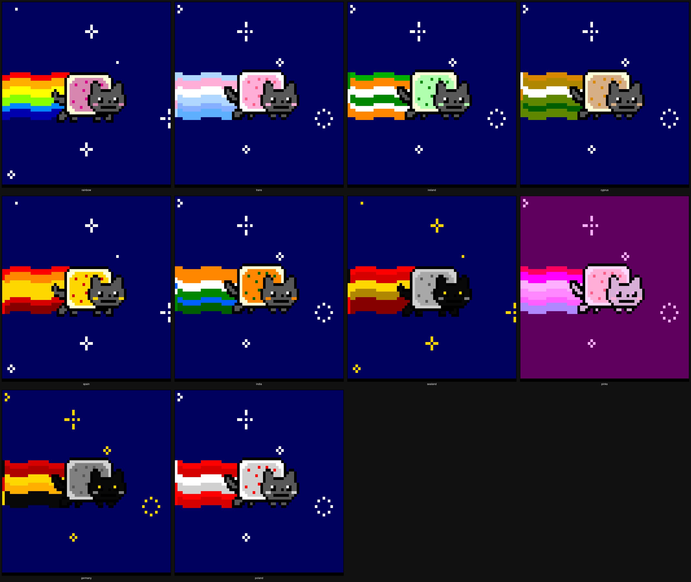

# nyan

Terminal Nyan Cat animation, ported from [taizilongxu/nyancat](https://github.com/taizilongxu/nyancat).



## Usage

```
python3 nyancat.py [--scheme SCHEME] [--random]
```

`--scheme` picks a colour scheme: `rainbow` (default), `trans`, `ireland`, `cyprus`, `spain`, `india`, `sealand`, `pinks`, `germany`, `poland`.

`--random` picks one at random.

The scheme auto-selects by date — national flags on their national days, `trans` throughout June.
